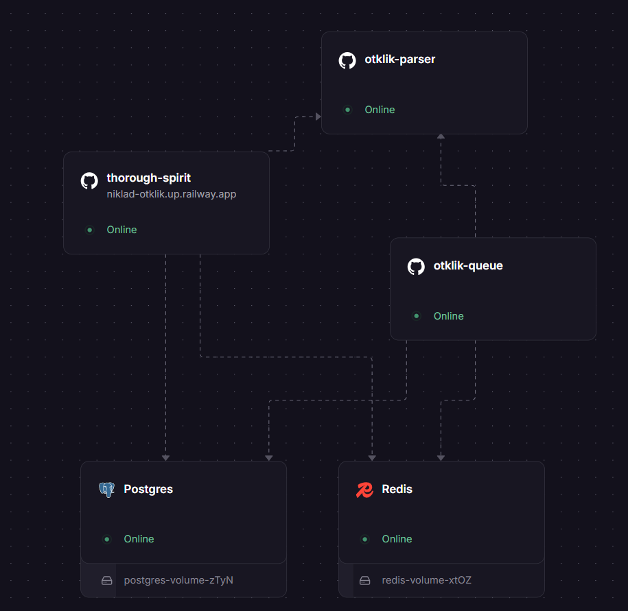

<p align="left">
  
</p>

# Интеграция с Яндекс.Картами — отзывы и рейтинг организации

Сделал: [Никита Павловский](https://github.com/NickPavlovskii)  
Дата: 13 сентября 2026

Сервис подключает карточку организации на Яндекс.Картах, парсит её отзывы и
рейтинг (у Яндекса нет официального API — используется парсинг), сохраняет
данные и отдаёт их через собственный API с постраничной навигацией.

Демо: [https://niklad-otklik.up.railway.app](https://niklad-otklik.up.railway.app/)  
Логин: `admin@example.com` / `password`.

<p align="center">
  
</p>

## Стек

- **Backend:** Laravel 13, PHP 8.3+, PostgreSQL 16, Redis 7
- **Очереди / кэш / сессии:** Redis (`QUEUE_CONNECTION=redis`, `CACHE_STORE=redis`, `SESSION_DRIVER=redis`)
- **Парсер:** Node.js + Playwright, отдельный контейнер, вызывается по HTTP
- **Frontend:** Vue 3, Composition API, Vite, Vue Router, Vuetify 3
- **Аутентификация:** Laravel Sanctum, SPA cookie-based (без токенов)
- **HTTP:** nginx + php-fpm

## Быстрый старт

```bash
git clone <repo-url>
cd yandex-maps-reviews-parser
docker compose up --build
```

Контейнер `php` сам делает `migrate --seed`. Тот же пользователь создаётся
миграцией `ensure_default_admin_user`, поэтому он появится и после обычного
`php artisan migrate` на пустой БД.

Единственный пользователь:

```
email: admin@example.com
password: password
```

| Сервис | URL |
| --- | --- |
| SPA | http://localhost:5173 |
| API | http://localhost:8080/api |
| Swagger | http://localhost:8080/api/documentation |
| Health | http://localhost:8080/api/health |
| Laravel health | http://localhost:8080/up |

Первый экран SPA — логин. Регистрации нет. После входа — настройки карточки
и лента отзывов. Vue ходит в API с `withCredentials`.

Повторно накатить миграции и сидер:

```bash
docker compose exec php php artisan migrate --seed
```

Очереди обрабатывает контейнер `queue` (`php artisan queue:work redis`).

## Хостинг

Этот стек (Laravel + Postgres + Redis + Playwright) **не встаёт на бесплатный Render / Netlify**.
Парсеру нужно ~2 ГБ RAM, плюс живые Postgres и Redis. Free-тарифы PaaS это не дают.

### Бесплатно и стабильно — Oracle Cloud Always Free

Always Free ARM-VM: 4 ядра и 24 ГБ RAM, хватает на текущий `docker compose`.

1. Аккаунт на [cloud.oracle.com](https://cloud.oracle.com) (карта для проверки, в лимите не списывают).
2. Create Instance: `VM.Standard.A1.Flex`, 4 OCPU / 24 GB, образ Ubuntu.
3. В Security List откройте порты 22, 80, 443.
4. На машине:

```bash
sudo apt update && sudo apt install -y docker.io docker-compose-v2 git
git clone <repo-url>
cd yandex-maps-reviews-parser
sudo docker compose up --build -d
```

Дальше поставьте Caddy/nginx на `:80` → `localhost:5173` или откройте `http://IP:5173`.
В `SANCTUM_STATEFUL_DOMAINS` и `FRONTEND_URL` укажите этот хост (IP или домен).

GitHub Student Pack (DigitalOcean / Azure) — тот же `docker compose`, но за учебный кредит.

### Бесплатно на пару дней — туннель с вашего ПК

Пока крутится локальный Docker:

```bash
winget install Cloudflare.cloudflared
cloudflared tunnel --url http://localhost:5173
```

В `SANCTUM_STATEFUL_DOMAINS` добавьте выданный хост `….trycloudflare.com`,
иначе логин по куке не пройдёт. ПК должен оставаться включённым. URL меняется
при каждом запуске, для сдачи ТЗ лучше фиксированный хост на Oracle.

### Railway

Один домен: Vue собирается в образ Laravel (`docker/render/web.Dockerfile`).
Нужны 5 сервисов в одном проекте: **Postgres**, **Redis**, **web**, **queue**, **parser**.

1. Запушьте репозиторий на GitHub.
2. [railway.app](https://railway.app) → **New Project → Deploy from GitHub repo**.
3. **New → Database → PostgreSQL**, затем **New → Database → Redis**.
4. Первый сервис (web): Settings → Build → Dockerfile path  
   `docker/render/web.Dockerfile`. После деплоя: Settings → Networking → **Generate Domain**.
5. **New → GitHub Repo** (тот же репозиторий) — это очередь.  
   Settings → Deploy → Custom Start Command:  
   `/usr/local/bin/queue-entrypoint.sh`  
   Dockerfile тот же: `docker/render/web.Dockerfile`. Домен этой службе не нужен.
6. **New → GitHub Repo** ещё раз — парсер.  
   Settings → Root Directory: `backend/parser`.  
   Settings → Resources: память **не меньше 2 GB**.
7. Переменные — блок ниже. После сохранения **Redeploy** web и queue.

Переменные **web** и **queue** (имена `Postgres` / `Redis` / `otklik-parser` подставьте как в кабинете):

```
APP_ENV=production
APP_DEBUG=false
APP_KEY=base64:...
APP_LOCALE=ru
LOG_CHANNEL=stderr
DB_CONNECTION=pgsql
DATABASE_URL=${{Postgres.DATABASE_URL}}
REDIS_URL=${{Redis.REDIS_URL}}
REDIS_CLIENT=phpredis
REDIS_CACHE_DB=0
CACHE_STORE=redis
QUEUE_CONNECTION=redis
SESSION_DRIVER=redis
SESSION_SECURE_COOKIE=true
TRUSTED_PROXIES=*
PARSER_SYNC_ENABLED=false
PARSER_TIMEOUT=300
PARSER_URL=http://otklik-parser.railway.internal:${{otklik-parser.PORT}}
PARSER_PRIVATE_PORT=${{otklik-parser.PORT}}
APP_URL=https://${{RAILWAY_PUBLIC_DOMAIN}}
FRONTEND_URL=https://${{RAILWAY_PUBLIC_DOMAIN}}
SANCTUM_STATEFUL_DOMAINS=${{RAILWAY_PUBLIC_DOMAIN}}
```

`APP_KEY` один раз локально:

```bash
php -r "echo 'base64:'.base64_encode(random_bytes(32)), PHP_EOL;"
```

У queue в `APP_URL` / `FRONTEND_URL` / `SANCTUM_STATEFUL_DOMAINS` укажите домен **web**, не свой:

```
APP_URL=https://${{otklik-web.RAILWAY_PUBLIC_DOMAIN}}
```

Логин: `admin@example.com` / `password`.  
Миграции и сидер web делает при старте.

Trial Railway (~$5) на парсер с 2 GB хватает ненадолго. Дальше — Hobby.

Frontend без Docker:

```bash
cd frontend
npm install
npm run dev
```

Парсер без Docker:

```bash
cd backend/parser
npm install
npx playwright install chromium
npm run parse -- "https://yandex.ru/maps/org/156355253662"
```

## Переменные окружения

| Переменная | Назначение |
| --- | --- |
| `APP_URL` | URL бэкенда, участвует в Sanctum stateful-доменах |
| `FRONTEND_URL` | Origin фронтенда, используется в CORS |
| `SANCTUM_STATEFUL_DOMAINS` | Домены, которым выдаётся сессионная кука SPA |
| `TRUSTED_PROXIES` | Локально `*` для nginx в Docker. На хостинге — IP балансировщика |
| `LOGIN_MAX_ATTEMPTS` | Лимит неудачных попыток входа на email+IP |
| `LOGIN_ROUTE_MAX_ATTEMPTS` | Лимит любых `POST /login` с одного IP |
| `DB_*` | Подключение к PostgreSQL |
| `REDIS_*` | Redis: очереди, кэш, сессии, health-check |
| `QUEUE_CONNECTION` | Драйвер очереди (`redis`) |
| `PARSER_URL` | URL Node-сервиса (`http://parser:3000`). Если не задан — Laravel запускает Node-скрипт через `Process` |
| `PARSER_TIMEOUT` | Таймаут ответа парсера, сек. (по умолчанию 300) |
| `PARSER_SYNC_ENABLED` | Служебный синхронный `POST /api/organizations/parse`. В production выключен |

## Архитектура

```
Vue 3 SPA
   │  cookie-сессия (Sanctum)
   ▼
Laravel API ──────────────► Redis (очередь, кэш, сессии)
   │
   └──► ParseOrganizationReviewsJob
   │
   ▼
PostgreSQL (organizations, reviews, parse_runs, review_snapshots)
   ▲
   │  HTTP POST /parse
Node-сервис (Playwright, переиспользуемый браузер)
   │
   ▼
Яндекс.Карты
```

### Backend

- `App\Contracts\MapsParser` — интерфейс парсера (можно добавить 2ГИС без смены вызывающего кода)
- `App\Services\Yandex\YandexMapsParser` — вызывает Node-сервис по HTTP либо запускает Node-скрипт как процесс
- `App\Services\Yandex\PersistParsedOrganization` — upsert отзывов, обновление организации и снапшот в одной транзакции
- `App\Services\Yandex\YandexMapsUrl` — извлечение `businessId` из ссылки (`?oid=`, `/org/{id}`, `businessId=`)
- `App\Jobs\ParseOrganizationReviewsJob` — асинхронный парсинг, 3 попытки с backoff `[30, 120, 300]` сек.

### Парсер (Node/Playwright)

- `server.js` — HTTP-обёртка (`POST /parse`), один переиспользуемый браузер между запросами
- `yandex-parser.js` — сбор данных
- Контейнер на `mcr.microsoft.com/playwright` — Chromium уже в образе

### Frontend

- `src/modules/auth/LoginPage.vue` — вход (email/пароль, «Запомнить меня»)
- `src/modules/settings/SettingsPage.vue` — ссылка на карточку, статус парсинга, поллинг без перезагрузки
- `src/modules/reviews/ReviewsPage.vue` — лента: поиск, сортировка, фильтр по звёздам, пагинация по 50
- `src/components/global` — общие UI-компоненты (`app-button`, `app-input`, `app-select` и др.)

Новый экран: папка в `frontend/src/modules/<domain>/`, маршрут в `frontend/src/router.ts`.
Новый API: контроллер в `backend/app/Http/Controllers/Api`, клиент в `frontend/src/api`.
Общий компонент: `.vue` в `components/global`, строка в `manifest.ts` и тип в `types/global-components.d.ts`.

## Подход к парсингу и обход защиты

### Найденный источник данных

Яндекс.Карты подгружают отзывы через внутренний запрос:

```
GET /maps/api/business/fetchReviews?businessId=...&csrfToken=...&sessionId=...&page=N&pageSize=50
```

Ответ — JSON с отзывами и параметрами пагинации (`totalPages`, `count` и т.д.).

### Сравнение вариантов

| Критерий | Разбор внутренних JSON-запросов | Headless-браузер (скролл) |
| --- | --- | --- |
| Скорость | Высокая — прямые HTTP-запросы, можно параллелить | Низкая — каждая порция ждёт скролла/рендера |
| Устойчивость к смене вёрстки | Средняя — не зависит от DOM, но зависит от структуры JSON | Выше — эмулирует поведение пользователя |
| Устойчивость к смене токенов | Низкая — `csrfToken`/`sessionId` завязаны на сессию | Высокая — браузер сам держит сессию |
| Затраты ресурсов (50+ организаций) | Низкие | Высокие |
| Риск антибота | Выше при пачке прямых запросов | Ниже — трафик похож на пользователя |

### Выбранное решение — гибрид

1. Для `businessId` и первичных данных (`avgRating`, `ratingsCount`, `reviewsCount`) — один заход Playwright с перехватом ответов (`page.on('response')`)
2. Пагинация отзывов в двух уровнях:
   - **Основной путь:** параллельные HTTP-запросы (до 5 сразу) к HTML карточки (`/maps/org/{id}/reviews/?page=N`), разбор встроенного JSON (`<script type="application/json">`)
   - **Fallback:** если HTML не дал ожидаемого числа отзывов — скролл и «Показать ещё» с перехватом `fetchReviews`
3. Браузер переиспользуется между запросами

Оговорка: HTML-путь проверен на тестовой карточке и не исчерпывает все типы страниц. Если он не сработает, включится fallback-скролл.

Подпись `s` у внутреннего `fetchReviews` при смене `page` отвечает 400 — поэтому основной быстрый путь именно HTML-карточка, а не XHR.

### Как парсер обнаруживает, что сломался

- Данные ищутся «по форме»: любой массив с `reviewId`, любой объект с `ratingData`
- Если ни HTML, ни `fetchReviews` не вернули ожидаемую структуру — ошибка `STRUCTURE_CHANGED`, не пустой успех
- Пустой список отзывов сам по себе не ошибка: 0 отзывов у организации — это `success` с `reviews_count = 0`
- Капча / HTTP 403 — код `BLOCKED`
- На Laravel это разные исключения и статусы: `failed_structure_changed` и `failed_blocked`

Если Яндекс не отдал средний рейтинг, Laravel считает его из сохранённых отзывов. Разбивка по звёздам (`rating_breakdown`) тоже строится из своей БД.

## Фоновая обработка

Парсинг не выполняется внутри пользовательского HTTP-запроса.
`POST /api/organizations` сохраняет ссылку, ставит `ParseOrganizationReviewsJob`
в очередь и отвечает `202 Accepted`. Фронт узнаёт о завершении через поллинг
`GET /api/organizations/{id}`:

`pending` → `in_progress` → `success` / `failed_structure_changed` / `failed_blocked` / `failed_unavailable`.

Служебный `POST /api/organizations/parse` парсит синхронно. В production
выключен (`PARSER_SYNC_ENABLED`, по умолчанию выкл. при `APP_ENV=production`)
и отдаёт 404 до валидации.

`POST /api/yandex/parse` — старое имя того же `store()`: тоже 202 и очередь.

Ретраи — 3 попытки с backoff `30/120/300` секунд. Каждая организация — свой Job.

## Анти-бан

Реализовано:

- Переиспользуемый браузер вместо нового Chromium на каждую организацию
- Кастомный User-Agent, реалистичный viewport и locale
- Распознавание капчи/403 с остановкой попыток

Описано, но не сделано:

- Троттлинг между организациями на уровне очереди
- Ротация прокси и пула User-Agent
- Отдельный backoff именно для `failed_blocked`

## Идемпотентность и история изменений

- `reviews.yandex_review_id` — уникальный индекс, вставка через `updateOrCreate()`
- `review_snapshots` — срез агрегатов после каждого успешного парсинга
- `parse_runs` — лог попыток (статус, число отзывов, ошибка, время)

Не сделано: пословная история текста/рейтинга конкретного отзыва. При необходимости —
таблица `review_changes` перед `updateOrCreate()`.

## Что принимают ссылки

Нужна карточка организации, из которой без сети извлекается `businessId`:
`/org/123`, slug + id, `oid=`, `poi[uri]`, `businessId=`.

Короткие «Поделиться» вида `https://yandex.ru/maps/-/CHHD5XYs` отклоняются:
в них нет oid, только код редиректа. Резолвить редирект в FormRequest не стали.
Если доделывать — отдельный шаг в Job/сервисе, один переход, затем обычный `businessId`.

## API

Полная спецификация — в Swagger (`/api/documentation`).

```
POST /login                              — вход (email, password, remember)
POST /logout                             — выход
GET  /user                               — текущий пользователь

POST /api/organizations                  — сохранить ссылку, поставить в очередь (202)
GET  /api/organizations/{id}             — организация, статус, rating_breakdown
GET  /api/organizations/{id}/reviews     — отзывы: page, per_page, q, sort, rating
GET  /api/health                         — статус кэша / очереди / Redis
```

Лимит входа: неудачные попытки на email+IP и отдельно любой `POST /login` с одного IP,
чтобы не гонять `Auth::attempt` при флуде.

## Тесты

```bash
docker compose exec php php artisan test
docker compose exec frontend npm test
```

Бэкенд: извлечение `businessId`, персистентность и идемпотентность, Job при ошибках
парсера, HTTP-слой организаций, фильтры отзывов, `rating_breakdown`, вход и лимиты логина.

Фронт: форматтеры, константы рейтинга, сторы, маршруты гостя/авторизации
и основные проверки глобальных компонентов, карточки отзыва и пагинации.

## Известные ограничения

- Короткие ссылки Яндекса (`yandex.ru/maps/-/...`) — нет `businessId` в URL
- Троттлинг и ротация прокси/UA — см. «Анти-бан»
- Индекс `(organization_id, published_at)` на `reviews` ускорит пагинацию на больших объёмах
- `ParserStructureChangedException` сейчас ретраится наравне с таймаутом и блокировкой;
  при сломанной разметке повтор обычно бесполезен — лучше сразу финальный отказ
